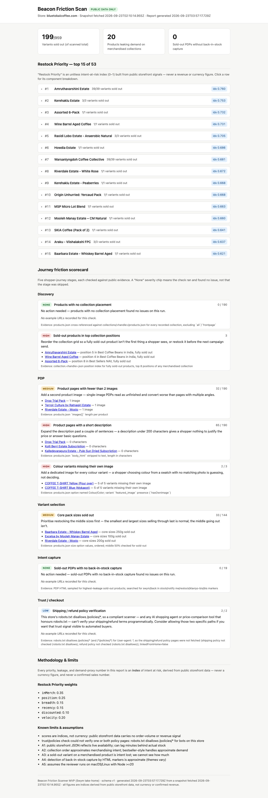

# Beacon Friction Scanner (MVP)

> **Store pick flagged, not yet explicitly approved by Ashish.** The spike (`docs/spike-store-selection.md`) picked **bluetokaicoffee.com** (fallback: **gymshark.com**) against the criteria in `docs/PRD.md §6`, and — per the work order's own contingency — proceeded without waiting on a reply. Full reasoning, including a criterion reinterpretation, is in `docs/decisions-during-build.md` (D-01). The real, live scan below (task I.3) has since run successfully against this store, at Ashish's own request. Swap the host if a different store is preferred; re-running the spike against another candidate is cheap.

Beacon scans a Shopify store's public storefront data and tells a merchant which sold-out products are leaking the most demand, in what order to restock them, and where else in the shopper journey that intent is going missing.

## Headline finding

From two real, live scans against `bluetokaicoffee.com` — 2026-09-22 and again 2026-09-23, ~14h apart — with `beacon diff` run between them (full report: [`out/EXAMPLE/report.html`](out/EXAMPLE/report.html)):

- **199 of 959 variants** are sold out across the 190 scanned products, and **20 products** are leaking that demand while still sitting in a merchandised collection (`bestsellers`, `coffee-beans`, etc.) — the clearest form of intent hitting a dead end.
- Intent capture: **0 of 19** sampled sold-out product pages had no back-in-stock signup — this store already runs a generic capture mechanism (no `swym` marker found, though), so the gap for Swym here is adoption, not absence.
- Top of the restock list: **Amruthavarshini Estate** (idx 0.760, 39/39 pack-size variants sold out, position 5 in "Best Coffee Beans in India") — see the top-15 table in the report for the rest, each with the components behind its score.
- Diff between the two runs: **zero** variants sold through or restocked (`out/EXAMPLE/delta.json`) — a genuinely quiet 14-hour window for this store's inventory, not a stubbed feature; `beacon diff`'s sell-through/restock detection and `velocity` scoring component are implemented and tested (`tests/engine.test.ts`), just with nothing to show on this particular pair of runs.
- Spot-check: `https://bluetokaicoffee.com/products/amruthavarshini-estate` was, as of the first scan, genuinely fully sold out and does sit in a merchandised collection — matching the report.

These are indices, not revenue figures — public storefront data has no order-volume signal, so nothing here is stated in currency (see [MVP boundary](#mvp-boundary) and Assumption A3 below).



## Quick start

```bash
npm i
npx beacon scan https://bluetokaicoffee.com
```

This writes a timestamped run to `out/bluetokaicoffee.com/<ISO-timestamp>/`: `snapshot.json`, `findings.json`, `restock_priority.csv`, `report.html` (open it directly, no server needed), and a terminal summary of the three headline numbers plus the top 10 restock rows. First run takes under five minutes on a normal connection; a `.cache/` directory keeps re-runs fast and under the same request budget.

**Programmatic use** — the CLI is a thin wrapper around the same library call:

```js
import { scanStore } from "beacon-scan";

const { findings } = await scanStore("https://bluetokaicoffee.com");
console.log(findings.headline);
console.log(findings.restock[0]); // top restock priority row
```

## Where the rest of the exercise lives

| Part | Location |
|---|---|
| Example report (offline fixture run — see note above) | [`out/EXAMPLE/report.html`](out/EXAMPLE/report.html) |
| Part 2 — architecture (NL query at 50K-store scale) | [`docs/part2-architecture.md`](docs/part2-architecture.md) |
| Part 2 — defensibility (standalone product or Shopify feature) | [`docs/part2-defensibility.md`](docs/part2-defensibility.md) |
| Part 3 — discovery and prioritisation framework | [`docs/part3-discovery.md`](docs/part3-discovery.md) |
| AI workflow (how this was built, with Claude Code) | [`docs/ai-workflow/README.md`](docs/ai-workflow/README.md) |
| Loom walkthrough (≤3 min) | *not yet recorded — see `docs/loom-shot-list.md`* |
| PDF mirror of this write-up | *not yet generated — see [`scripts/export-pdf.md`](scripts/export-pdf.md)* |

## MVP boundary

This is a deliberately bounded MVP. The following is what it does **not** do, quoted verbatim from the locked PRD (`docs/PRD.md §1`) — this is the honest list of reasons Swym couldn't use this as-is:

- **N1.** No hosted service, scheduler, multi-store, auth, database server, or UI beyond a static HTML report.
- **N2.** No runtime LLM. The NL-query layer is designed in `docs/part2-architecture.md`, not implemented.
- **N3.** No Swym data integration; no assumptions about Swym internals.
- **N4.** Scoring is a transparent v0 heuristic with weights in one config file; no calibration, no ML.
- **N5.** Only two friction families are scored in depth (Demand Leakage, Variant/PDP hygiene); the other journey stages get 1–2 cheap presence checks each.
- **N6.** No PDP screenshotting, no headless browser, no review-platform scraping.
- **N7.** No API keys, auth, tenancy, or hosted API. The code is **library-first** (`import { scanStore } from "beacon-scan"`) with the CLI as a thin wrapper, so the shape of an eventual SDK is visible; keys/tenancy/rate plans are designed in `docs/part2-architecture.md`, not built. Public-data scanning has nothing to authenticate, and a working key system would make this adoptable as-is.

## Assumptions

From `docs/PRD.md §7`, stated here because a reviewer running this against a different store should know what's being taken on faith:

- **A1.** Public storefront JSON reflects live availability (Shopify serves it from the same catalogue; it can lag by minutes).
- **A2.** Collection order approximates merchandising intent; "bestseller"-style handles approximate demand.
- **A3.** A sold-out variant on a merchandised product is intent lost; the scan cannot see how much.
- **A4.** Detection of back-in-stock capture by HTML markers is approximate — themes vary.
- **A5.** The reviewer runs on macOS/Linux with Node ≥20.

## What the scan checks

One headline score (Restock Priority / Demand Leakage) plus a five-stage journey scorecard, all from public data only — `/products.json`, `/collections.json`, per-collection product listings, and a throttled sample of sold-out product pages. `docs/PRD.md §3` has the full scoring formula and weights; `beacon.config.json` holds the weights themselves, in one file, so the heuristic isn't buried in code.

| Stage | What's checked |
|---|---|
| Discovery | Orphan products (in no collection); sold-out products sitting in top collection positions |
| PDP | Products with fewer than 2 images; short descriptions; colour variants missing an image |
| Variant selection | Size-curve holes — whether the *middle* sizes, not just the edges, are sold out |
| Intent capture | Sampled sold-out PDPs checked for a back-in-stock signup mechanism |
| Trust | Shipping/refund policy pages present and linked from the homepage — or, if `robots.txt` disallows checking them, that's stated rather than guessed |

Every finding in the report carries its evidence (endpoint and field) and a recommendation — nothing is asserted without a source.
